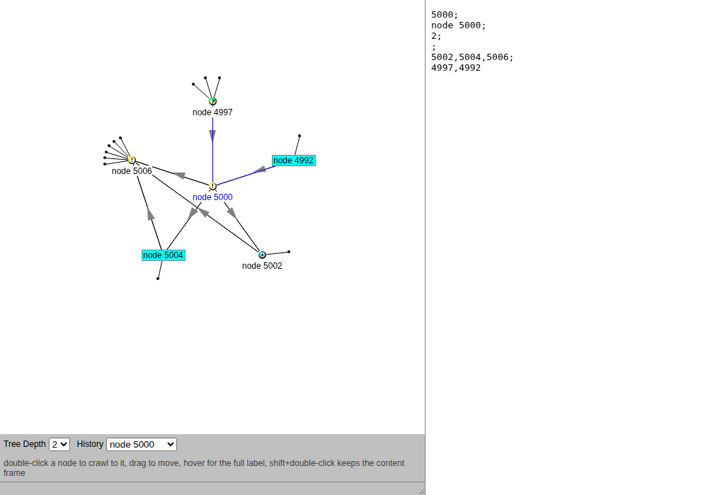
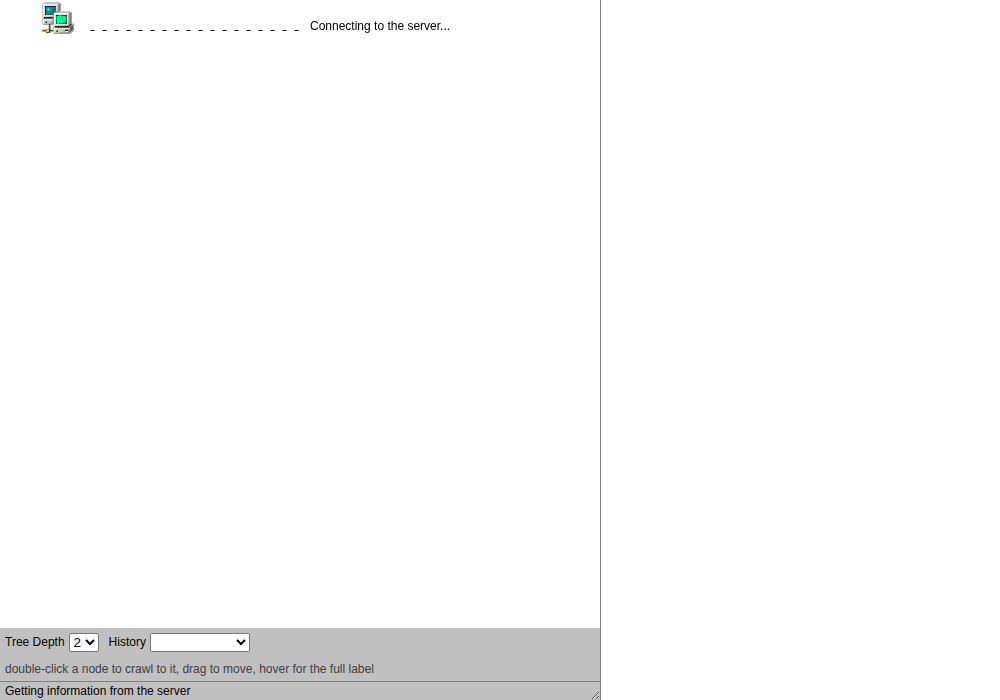

# graphcrawl

**Crawl a graph of any size by double-clicking through it, seeing only the depth-N neighbourhood of one node at a time.**

A 1999 Java 1.0 applet ported to the browser canvas, behaviour kept (the
glide to the centre, the sector placement, the bulb stubs for hidden
neighbours, the wrapped labels, the "Connecting to the server" animation),
over a C backend that reads a plain-text graph file sorted by id. The file
is the index: a node is found by binary search, its neighbourhood by a
breadth-first walk of N-1 hops, and nothing of the graph is held in memory.
Ten lines or a trillion, the process is the same two megabytes.

  

<em>A node of a generated graph at depth 2. Cyan nodes have children and can be crawled into; green ones are terminals; blue is visited.</em>

  
  

## Run

    make
    ./graphcrawl example/family.txt          # serves http://127.0.0.1:8090/ and opens it
    ./util/mkgraph -n 10000000 > ten.txt     # a ten-million-node graph with locality, 520 MB
    ./graphcrawl ten.txt

`http://127.0.0.1:8090/#ID` starts at node ID. `/demo.html` is the 1999
family demo with no server behind it. `--no-open` (or `GRAPHCRAWL_NO_OPEN=1`)
keeps the browser closed; `-p PORT` moves the port.

The same engine at the terminal, which is what the server calls:

    ./graphcrawl --node 5000 -d 2 ten.txt    # the lines the page would receive
    ./graphcrawl --check ten.txt             # parseable, ids ascending
    ./graphcrawl --info ten.txt              # first id, last id, size

## The file

One node per line, sorted by id, the 1999 applet's wire line kept as the
storage line (`doc/FORMAT.md`):

    id;label;category;url;children;parents
    id child child child                      (the bare form)

Sort an unsorted file once with `sort -t';' -k1,1n`. Parents can stay off
the line and come from a side file built by an external sort:

    graphcrawl --reverse FILE | sort -t';' -k1,1n -k2,2n -u > FILE.parents

## Cost

Measured on the ten-million-node file above, one core, warm cache:

| operation | time | resident memory |
| --- | --- | --- |
| `--check` (streams all 520 MB) | 1.6 s | 1.8 MB |
| one click, depth 2 or 3 | under 10 ms | 2.2 MB |
| 100 clicks over HTTP, `curl` included | 0.47 s | |

A lookup is about log2(lines) probes, each one seek and one line; locality
of ids puts a node's neighbours on the pages the first probes already
touched. `doc/FORMAT.md` gives the bounds and the sharding discussion.

## The view

`web/graphcrawl.js` is the applet class by class (`doc/PORT.md` has the map
and the four deviations). Double-click a node to crawl to it; shift held
keeps the content frame. Drag to move a node. Hover for the full label.
Tree Depth 2 or 3 re-expands the central node. History re-centres an
earlier node.

The browser canvas over localhost is the portable front-end, as in `ais
--serve`: one page, every desktop, no framework. SVG would give a DOM node
per graph node and slower animation; WebGL is for views too large to be
useful here, where the view is by design a few dozen nodes. The page is
plain files in `web/`, embedded into the binary by `c/embed.sh`, and served
from disk instead with `GRAPHCRAWL_WEB=web`.

## Layout

    c/          the engine: line.c (grammar), graph.c (binary search, walk,
                check, reverse), serve.c (HTTP/1.0 on 127.0.0.1), main.c,
                tests.c; web.c is generated from web/
    web/        index.html, demo.html, graphcrawl.js, graphcrawl.css, the 1999 gifs
    util/       mkgraph.c, a generator with id locality, sorted by construction
    tests/      run.sh (CLI + HTTP), shot.sh (headless screenshot), drive.html
    doc/        FORMAT.md, PORT.md
    example/    family.txt (the 1999 demo as a file)
    legacy/     the 1999 snapshots, screenshots, and Professor Even's lecture notes
    AGENTS.md   how to work on it; the C rules are ais's STYLE.md

    make ut     engine tests + CLI/HTTP tests

## Lineage

The neighbourhood-at-a-time idea comes from the advanced graph algorithms
course of the late Professor Shimon Even (1935-2004), whose student the
author was. The applet dates from November 1999 to January 2000
(`legacy/README.md`). Node placement here is circles and sectors with no
overlap avoidance; placement by stochastic search is the subject of
[cjitter](https://github.com/Anode1/cjitter). The C style and the sorted
plain-text index follow [ais](https://github.com/Anode1/ais).

## License

GNU GPL v2 or later. Author: Vasili Gavrilov (GitHub [Anode1](https://github.com/Anode1)).
