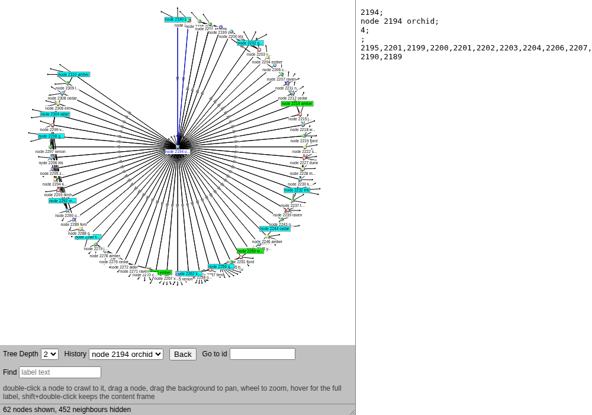
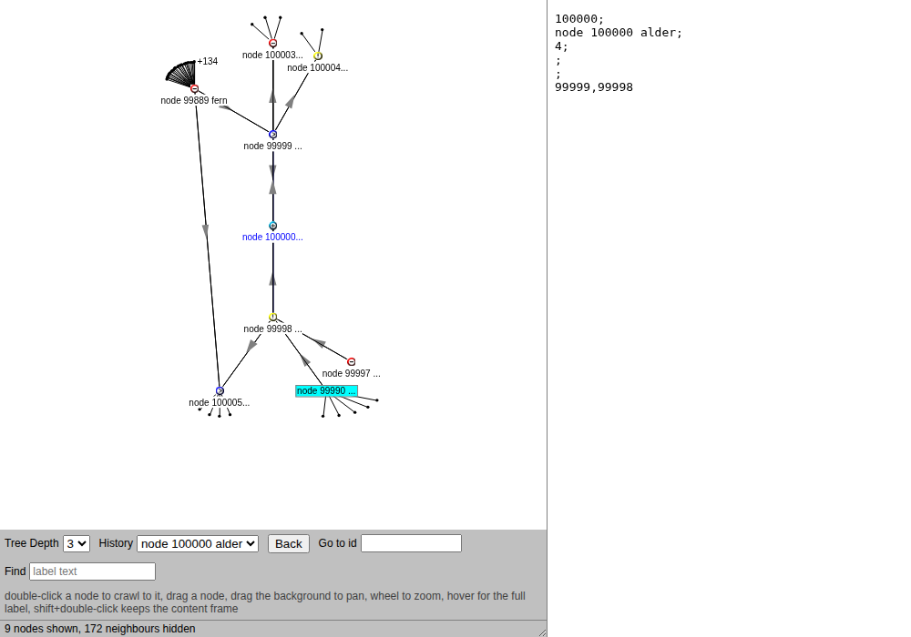
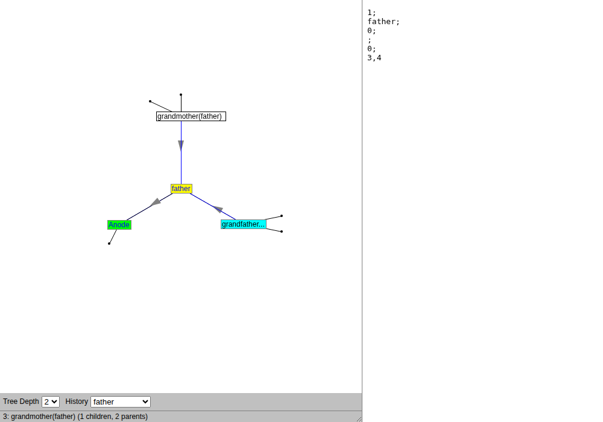

# graphcrawl

**Crawl a graph of any size by double-clicking through it, seeing only the depth-N neighbourhood of one node at a time.**

A 1999 Java 1.0 applet ported to the browser canvas, behaviour kept (the
glide to the centre, the sector placement, the bulb stubs for hidden
neighbours, the wrapped labels, the "Connecting to the server" animation),
over a C backend that reads a plain-text graph file sorted by id. The file
is the index: a node is found by binary search, its neighbourhood by a
breadth-first walk of N-1 hops, and nothing of the graph is held in memory.
Ten lines or a billion, the process is the same two megabytes.

  

<em>A hub with 394 children in a generated graph. Sixty get a place on the circle, the rest are stubs and a count; cyan nodes can be crawled into, green ones have no children, blue is visited.</em>

  
  

## Run

    make
    ./graphcrawl example/family.txt          # serves http://127.0.0.1:8090/ and opens it
    ./util/mkgraph -n 10000000 -H 1000 -l 100 > ten.txt    # ten million nodes, hubs, long edges
    ./graphcrawl ten.txt

`http://127.0.0.1:8090/#ID` starts at node ID; `?depth=4` sets the depth.
`/demo.html` is the 1999 family demo with no server behind it. `--no-open`
(or `GRAPHCRAWL_NO_OPEN=1`) keeps the browser closed; `-p PORT` moves the
port.

The same engine at the terminal, which is what the server calls:

    ./graphcrawl --node 5000 -d 2 ten.txt    # the lines the page would receive
    ./graphcrawl --node 5000 -d 3 -D ten.txt # ... and how many lines the searches read
    ./graphcrawl --find quartz ten.txt       # labels holding a text (a full scan)
    ./graphcrawl --check ten.txt             # parseable, ids ascending
    ./graphcrawl --info ten.txt              # first id, last id, size

## The file

One node per line, sorted by id, the 1999 applet's wire line kept as the
storage line (`doc/FORMAT.md`):

    id;label;category;url;children;parents
    id child child child                      (the bare form)

An edge list (`src dst` per line, the shape of SNAP, Common Crawl, a
citation dump) becomes the file and its parents with two external sorts:

    sort -k1,1n -k2,2n -u EDGES | graphcrawl --group > FILE
    graphcrawl --reverse FILE | sort -t';' -k1,1n -k2,2n -u > FILE.parents

## Cost

Measured on a ten-million-node file (520 MB), one core, warm cache:

| operation | time | resident memory |
| --- | --- | --- |
| `--check` (streams all 520 MB) | 1.6 s | 1.8 MB |
| one click, depth 2 or 3 | under 10 ms | 2.2 MB |
| 100 clicks over HTTP, `curl` included | 0.47 s | |

And on a hundred-million-node file (6.6 GB, hubs up to 4000 children,
long-range edges; `tests/scale.sh 100000000`), NVMe, the file evicted from
the page cache before each cold click:

| operation | time | resident memory |
| --- | --- | --- |
| generate (`util/mkgraph`) | 1.5 min | |
| parents side-file: `--reverse` and external `sort` of 250M edges | 92 s | |
| `--check` (streams all 6.6 GB) | 19.6 s | 2.2 MB |
| one click, depth 2, cold or warm | under 10 ms | 2.9 MB |
| one click, depth 3 (13 to 21 nodes), cold or warm | under 10 ms | 2.9 MB |

A lookup is about log2(lines) probes, each one seek and one line: 27 per
node at 10^8 lines, which `-D` prints (267 to 329 lines read for a depth-2
click there, 695 to 1157 at depth 3). Memory is the same at 10^4 and 10^8
nodes; `doc/FORMAT.md` gives the bounds.

## The view

`web/graphcrawl.js` is the applet class by class (`doc/PORT.md` has the map,
the deviations, and the added parameters). Double-click a node to crawl to
it; shift held keeps the content frame. Drag a node; drag the background to
pan; wheel to zoom. Hover for the full label and the node's counts. Tree
Depth 1 to 6 re-expands the central node; after an expansion the view zooms
out until everything fits. Go to id and Find re-centre by id or by label
text; Back and the browser's history walk the crawl, since every node is
`#ID` in the URL.

Placement is the 1999 one: circles and sectors, no overlap avoidance; a hub
gets a wider circle, a deep level fewer neighbours. Placement by search is
[cjitter](https://github.com/Anode1/cjitter)'s subject.

The browser canvas over localhost is the portable front-end, as in `ais
--serve`: one page, every desktop, no framework. The page is plain files in
`web/`, embedded into the binary by `c/embed.sh`, and served from disk
instead with `GRAPHCRAWL_WEB=web`.

## Where it stands

A survey of the field (August 2026, with sources:
[`~/articles/graphcrawl/survey.md`](https://github.com/Anode1/articles)) finds
every browser-side viewer holding the graph in memory or on the GPU, with
stated ceilings of 10^3 to 10^6 elements, and every click-to-expand tool
(Neo4j Browser and Bloom, Memgraph Lab, AWS graph-explorer) delegating the
lookup to a database. Out-of-core systems (WebGraph, GraphChi) have no
viewer. graphcrawl is, as far as that survey found, the only open-source
neighbourhood browser whose index is a sorted text file and whose memory
does not grow with the graph. What it does not do: layout quality, queries,
properties on edges, editing, whole-graph overviews.

## Layout

    c/          the engine: line.c (grammar), graph.c (binary search, walk,
                check, reverse, group, search), serve.c (HTTP/1.0 on
                127.0.0.1), main.c, tests.c; web.c is generated from web/
    web/        index.html, demo.html, graphcrawl.js, graphcrawl.css, the 1999 gifs
    util/       mkgraph.c (a generator with locality, hubs, long edges),
                evict.c (drop a file from the page cache, for cold timings)
    tests/      run.sh (CLI + HTTP), scale.sh (cold and warm clicks at N nodes),
                shot.sh (headless screenshot), drive.html (a scripted crawl)
    doc/        FORMAT.md, PORT.md
    example/    family.txt (the 1999 demo as a file)
    legacy/     the 1999 snapshots, screenshots, and Professor Even's lecture notes
    AGENTS.md   how to work on it; the C rules are ais's STYLE.md

    make ut     engine tests + CLI/HTTP tests

## Lineage

The neighbourhood-at-a-time idea comes from the advanced graph algorithms
course of the late Professor Shimon Even (1935-2004), whose student the
author was. The applet dates from November 1999 to January 2000
(`legacy/README.md`). The C style and the sorted plain-text index follow
[ais](https://github.com/Anode1/ais).

## License

GNU GPL v2 or later. Author: Vasili Gavrilov (GitHub [Anode1](https://github.com/Anode1)).
